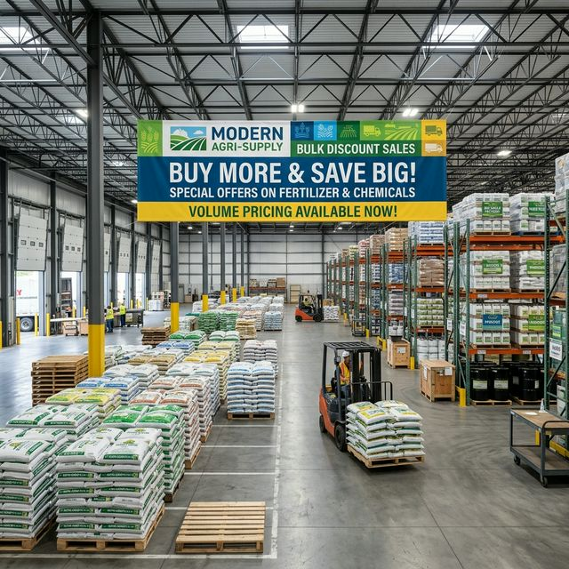

# Agro App

Agro App is a smart agriculture ecosystem that connects farmers, franchise operators, staff, and finance teams through a mobile app and a web admin dashboard. The platform helps manage products, orders, payments, notifications, inventory, customer relations, and support in a unified workflow.

## Project Overview

This repository contains two main applications:

- Mobile app: Flutter app for field operations and user-facing workflows
- Web app: Laravel application for admin, franchise, and management dashboards

## Highlights

- Product catalog and inventory management
- Order creation and tracking workflows
- Payment and finance dashboards
- Notification and real-time communication
- Franchise and staff role-based access
- Support tickets and chat interface
- Modern UI designed for agricultural operations

## Architecture

- Mobile frontend: Flutter
- Web backend/admin: Laravel
- Database: MySQL
- Real-time features: Laravel broadcasting / Reverb / notifications
- API layer: REST-based service integration

## Screenshots

### App preview

<div align="center">
  
  
</div>

## Repository Structure

```text
Agro_App/
├── agro_mobile/      # Flutter mobile application
├── agro_web/         # Laravel web backend and admin app
├── farmmantra.sql    # Project database dump
├── .gitignore
├── README.md
└── project scripts / setup helpers
```

## Getting Started

### Mobile app

```bash
cd agro_mobile
flutter pub get
flutter run
```

### Web app

```bash
cd agro_web
composer install
cp .env.example .env
php artisan key:generate
php artisan migrate
php artisan serve
```

## Notes

This project is designed to showcase a professional agri-business workflow with clear roles, data visibility, and operational dashboards. The design is intended to feel modern and production-friendly for agricultural commerce operations.

## License

This project is for demonstration and portfolio use. Please review and adapt licensing terms according to your production requirements.
